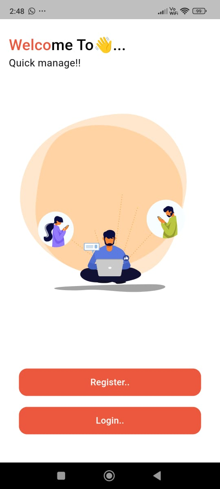
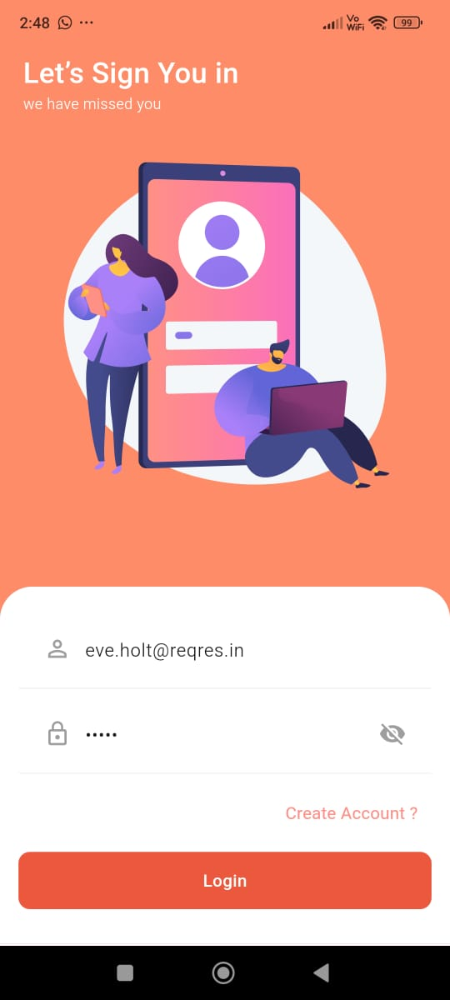
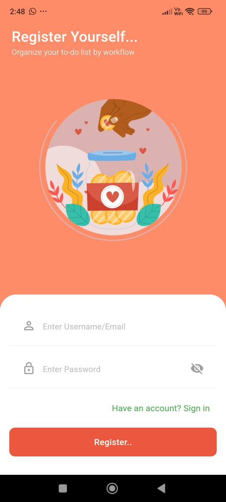
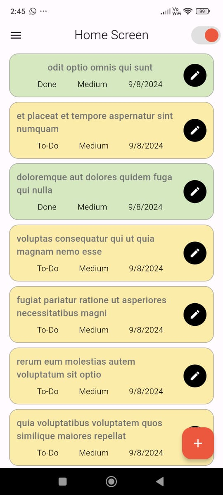
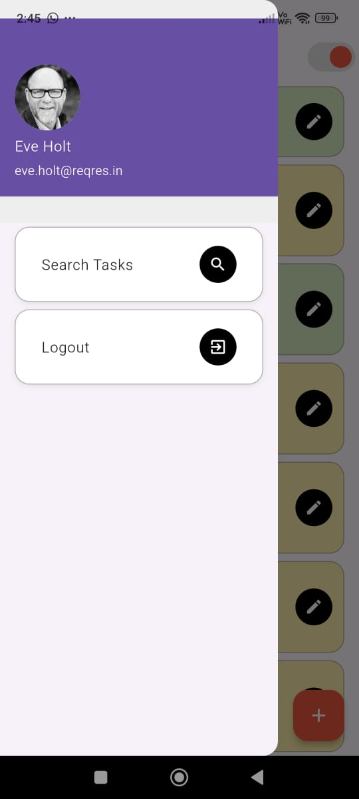
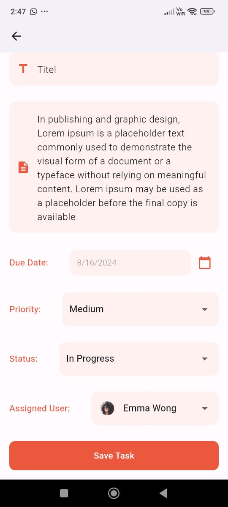
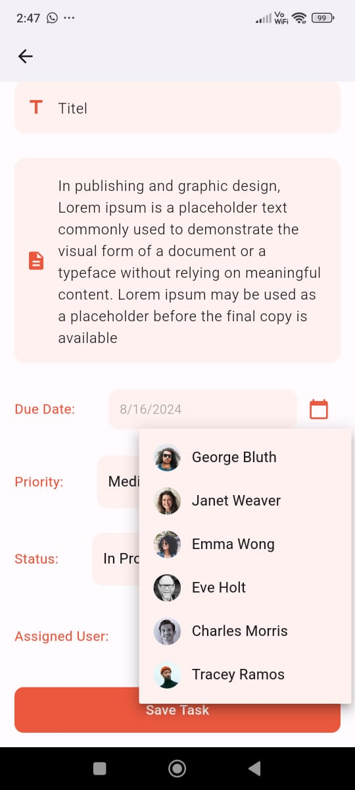
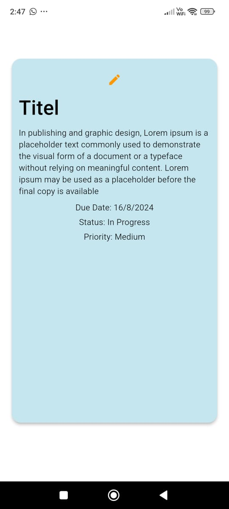
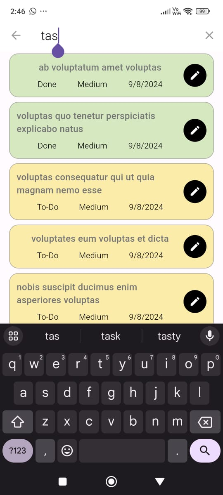
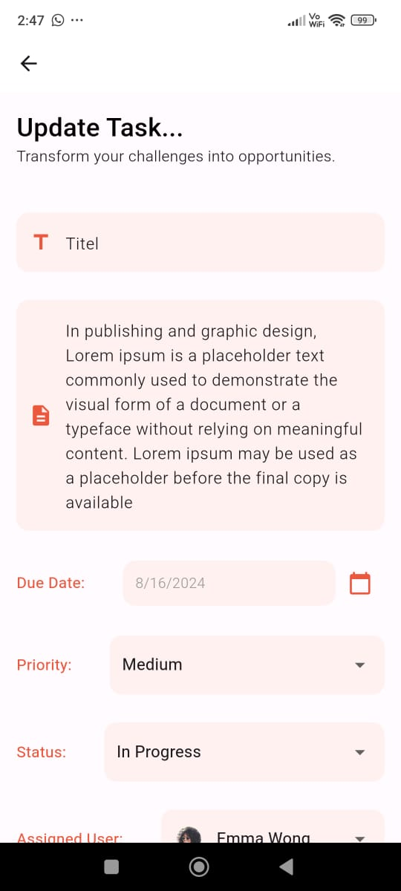

# QuickManage App

QuickManage is a task management app developed using Flutter. The app allows users to manage tasks efficiently with a clean, responsive UI. This project focuses on providing a smooth and interactive experience while implementing all the required features as per the provided assignment documentation.

## License

MIT License

© 2024 Toushik Banik

Permission is hereby granted, free of charge, to any person obtaining a copy
of this software and associated documentation files (the "Software"), to deal
in the Software without restriction, including without limitation the rights
to use, copy, modify, merge, publish, distribute, sublicense, and/or sell
copies of the Software, and to permit persons to whom the Software is
furnished to do so, subject to the following conditions:

---

## Features

- **User Registration:**
  - New users cannot be created in the backend. To register, use the provided credentials:
    - **Email:** `george.bluth@reqres.in`
    - **Password:** `cityslicka`

- **User Login:**
  - Log in using the predefined credentials:
    - **Email:** `eve.holt@reqres.in`
    - **Password:** `pisto`
  - Once logged in, users will remain logged in based on the saved token from the previous session.

- **Task Management:**
  - **Task Creation:**
    - Tasks created are added to the local list for user interaction. However, they are not updated on the server due to API limitations. Tasks will not persist if the app is restarted, as they are stored temporarily.
  - **Task Update:**
    - Tasks retrieved from the API can be updated. However, locally created tasks cannot be updated due to server limitations.
  - **Task Filtering:**
    - Use the orange button at the top of the page to filter tasks assigned to you or all users.
  - **Task Search:**
    - Search tasks from the drawer using either the title or description.

- **User Logout:**
  - Users can log out from the drawer.

## Technologies Used

- **Flutter:** For building the UI and managing app state.
- **Provider:** For state management.
- **Screen Utils:** For creating a responsive UI.
- **Lottie JSONs:** For animations.

## Folder Structure

Here is an overview of the folder structure used in the project:

```
QuickManage/
│
├── Api/
│   ├── models/
│   │   └── user_model.dart
│   └── ApiService.dart
│
├── Const/
│   ├── widgets/
│   │   └── custom_button.dart
│   └── color.dart
│
├── Provider/
│   └── task_provider.dart
│
├── Screens/
│   ├── login_screen.dart
│   ├── task_form_screen.dart
│   └── home_screen.dart
│
└── main.dart
```

- **Api Folder:**
  - **models/**: Contains all the data models required for the app.
  - **ApiService.dart**: Manages all API calls.

- **Const Folder:**
  - **widgets/**: Custom widgets used throughout the app.
  - **color.dart**: Defines the color palette for consistent UI design.

- **Provider Folder:**
  - **task_provider.dart**: Manages state and logic for task management.

- **Screens Folder:**
  - Contains all the UI components or view files, such as `login_screen.dart`, `task_form_screen.dart`, and `home_screen.dart`.

## Limitations

- The app is fixed in portrait mode due to time constraints and UI design considerations.
- Given the limited time (2 days), extensive testing and additional UI enhancements were not possible. The focus was on implementing all key features within the given timeframe.

## Conclusion

I have made every effort to build the app as smooth and interactive as possible while covering all the required features. I hope you find the app meets your expectations.

## Installation

To run the app on your local machine:

1. Clone this repository:
   ```bash
   git clone https://github.com/ToushikBanik123/QuickManage.git
   ```
2. Navigate to the project directory:
   ```bash
   cd QuickManage
   ```
3. Install the dependencies:
   ```bash
   flutter pub get
   ```
4. Run the app:
   ```bash
   flutter run
   ```

## Screenshots

### Welcome Page


### Login Page


### Registration Page


### Home Screen


### Drawer


### Create Task - Step 1


### Create Task - Step 2


### Create Task - Step 3


### Card View


### Task Search


### Toggle Search


### Select Date


### Update Task


## Contact

If you have any questions or feedback, feel free to reach out:

- **Email:** toushikbanikofficial@gmail.com
- **LinkedIn:** [LinkedIn Profile](https://www.linkedin.com/in/toushikbanik/)
